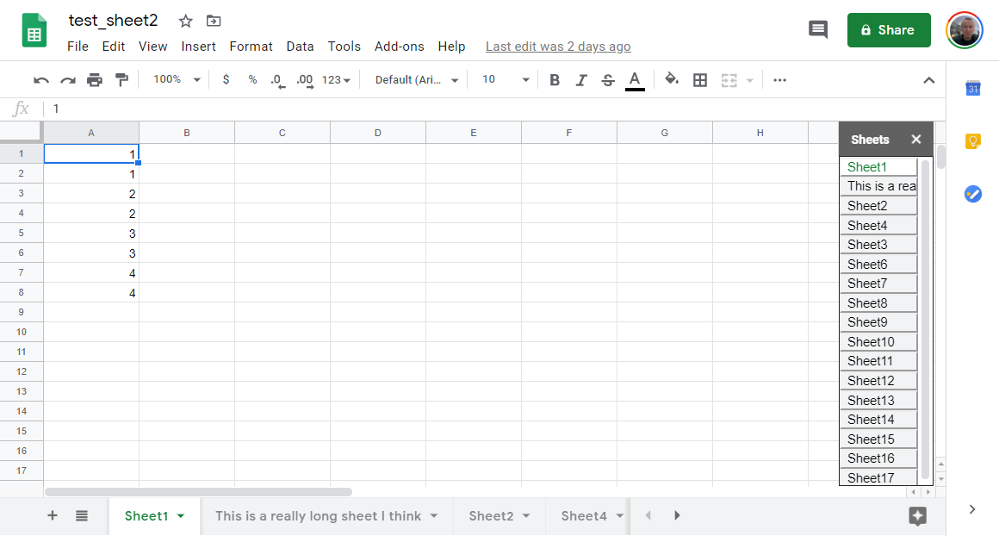

# Vertical GSheets Selector #

This code is currently a work in progres. You can use it to display a sidebar that displays sheet names. When you click on a sheet it should navigate to that sheet.

**The software available on this website are provided "as is" without warranty of any kind, either express or implied. Use at your own risk.**

# Setup #

1. Navigate to chrome://extensions/
2. Make sure developer mode is enabled (upper right)
3. Select "load unpacked" (upper left) and choose the code directory labeled "extension" in this repo.

# Usage #

1. Load a Google Spreadsheet
2. After loading has finished, go to the **"Add-ons"** menu and select **"Launch Vert Tabs"**. A sidebar should pop-up on the right.
3. Clicking on a sheet name on the right should navigate to the correct sheet.

# Warning Notes #

This is my first js project and currently the code needs to be cleaned up and documented. I still have a few features I want to add like listening for sheet deletions, renames, and selections from the main horizontal selector. I don't attempt to manipulate the data in the sheet in anyway, but still, use at your own risk.

# Feature Status #

**Mirroring Features** - i.e. tracking what happens from interacting with the horizontal interface

- update on add sheet - DONE
- update on sheet selection via all sheet selector - NYI
- update on sheet dragging - DONE
- update on sheet left click - DONE
- Update on sheet right click - DONE
- Move Left & Right - DONE
- Hide Sheet - NYI - just needs to respect hidden status as observer captures DOM change but element still exists (presumably class list change)
- Color Support - NYI
- Rename - NYI
- Duplicate - DONE
- Delete - DONE

**Other Features**

- resize via dragging side of panel - DONE
- resize on hiding menus - DONE - sometime flaky ...
- force rerender - DONE, click on the word "sheets" on top to force rerendering

TODO

# Improvements #

- fix resize to be more responsive, base on target width/height, not on being different - use observers ...
- clean up code!!!!
- make force rerender more obvious (add refresh button?)